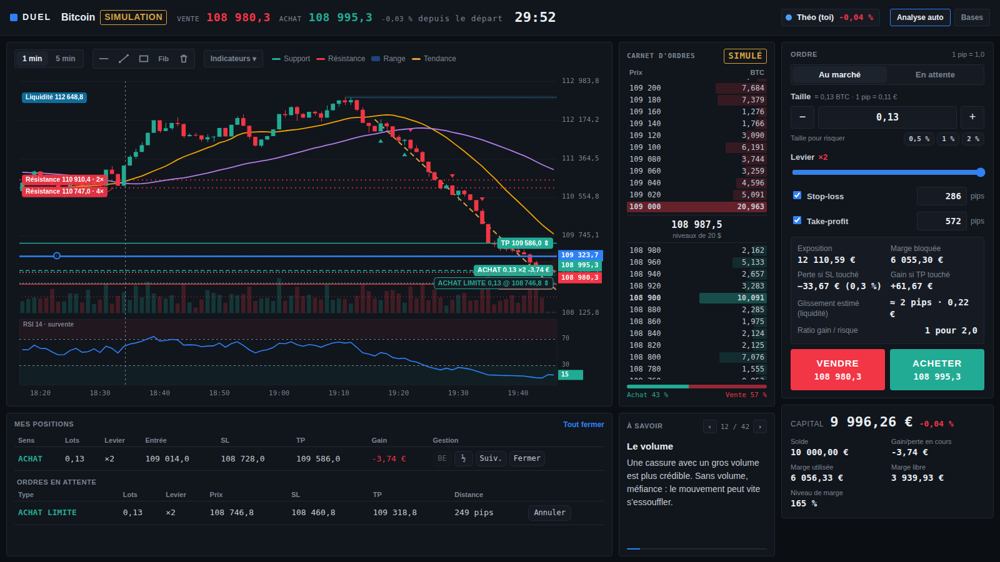
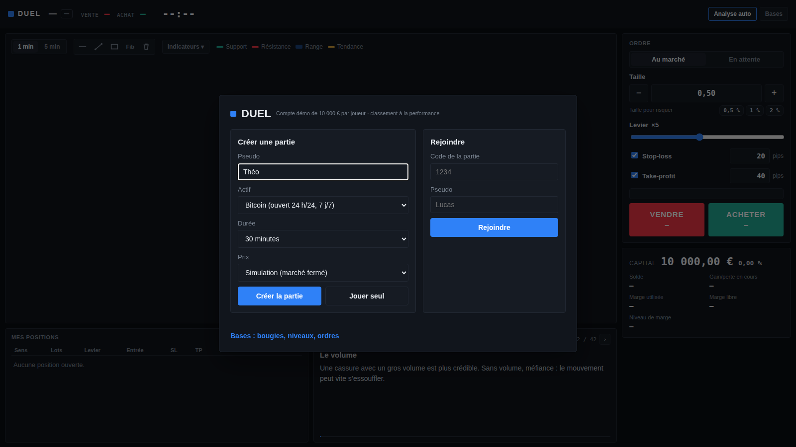
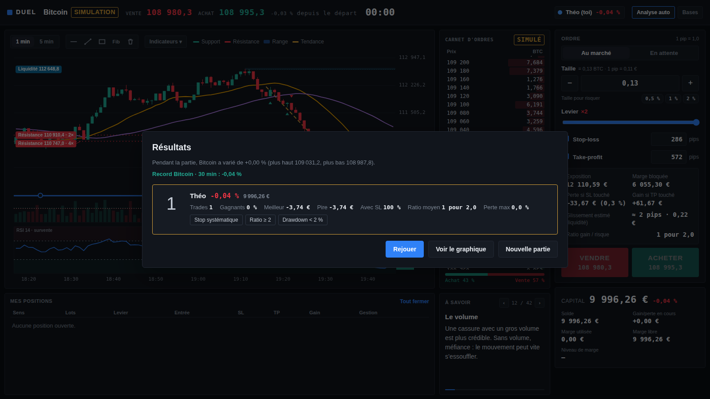
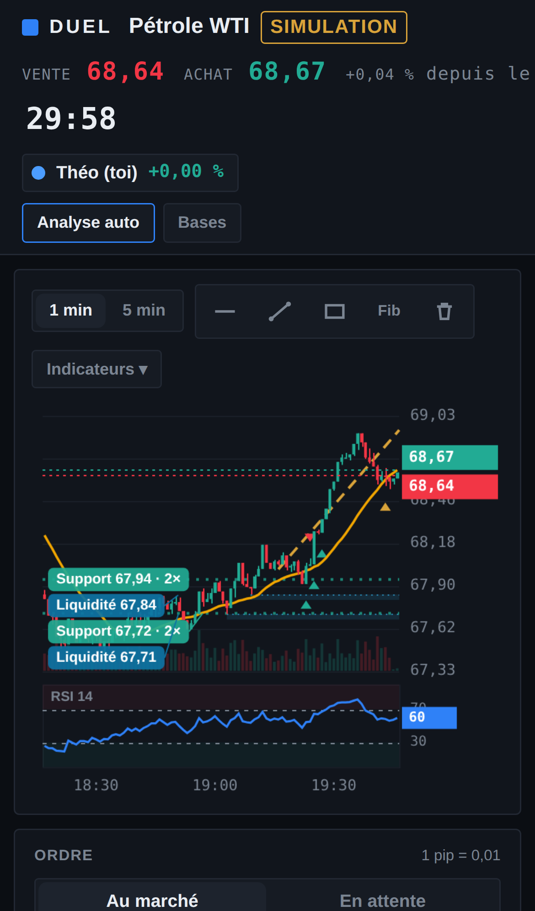
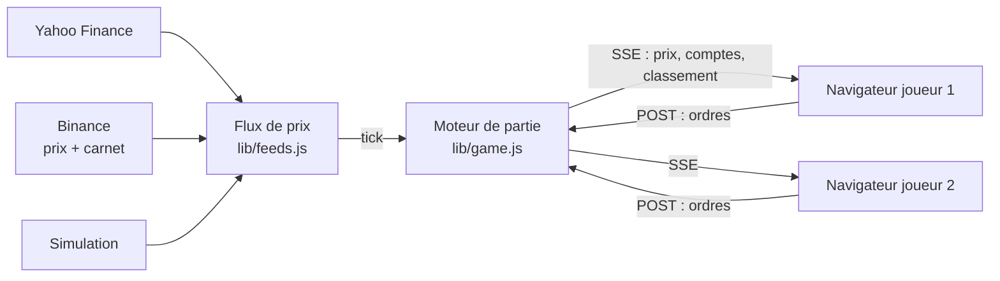

# DUEL — simulateur de trading multijoueur en temps réel

**▶ [Jouer en ligne](https://duel-trading.onrender.com)** · hébergement gratuit : le premier chargement peut prendre 30 à 60 secondes (le serveur se réveille).

Plateforme de trading pédagogique : chaque joueur reçoit un compte démo de 10 000 € et trade le pétrole, l'or, l'EUR/USD
ou le bitcoin sur des **prix réels**, en solo ou en duel contre des amis. Le classement se fait à la performance.
L'objectif : apprendre en pratiquant ce qu'on lit dans les manuels — effet de levier, marge, stop-loss, ratio
gain/risque, carnet d'ordres, liquidité — avec des règles proches de celles d'un vrai courtier.



## Ce que fait la plateforme

**Marché**
- Prix en direct : Yahoo Finance (pétrole WTI et Brent, or, EUR/USD) et Binance (bitcoin). Hors séance, bascule
  automatique sur une simulation réaliste qui alterne phases de tendance et de range.
- **Carnet d'ordres réel du bitcoin** (Binance) : niveaux agrégés, murs, déséquilibre acheteurs/vendeurs, profondeur
  dessinée le long de l'échelle de prix.

**Exécution réaliste**
- Ordres au marché, **ordres limite et stop**, stop-loss et take-profit déplaçables directement sur le graphique.
- **Glissement** calculé en « consommant » le carnet réel pour le bitcoin, selon un modèle de profondeur pour les autres actifs.
- **Spread dynamique** qui s'élargit quand la volatilité augmente.
- Levier plafonné aux limites réglementaires européennes pour les particuliers (×30 EUR/USD, ×20 or, ×10 pétrole, ×2 bitcoin).
- Marge, appel de marge à 100 %, liquidation forcée à 50 % de niveau de marge.
- Gestion de position : stop au prix d'entrée, clôture partielle, stop suiveur.
- Calcul de la taille de position à partir du risque souhaité (0,5 / 1 / 2 % du capital).

**Analyse**
- Graphique en bougies 1 et 5 minutes, dessiné sur canvas : moyennes mobiles 20/50, bandes de Bollinger, RSI 14, volume.
- Détection automatique des supports, résistances, ranges, tendances, figures de bougies et **zones de liquidité**.
- Outils de dessin : ligne horizontale, oblique, zone, retracement de Fibonacci.
- Rubrique « À savoir » : une notion de marché expliquée en quelques lignes, renouvelée toutes les deux minutes.

**Jeu**
- Parties de 5 à 60 minutes, jusqu'à 4 joueurs, invitation par lien ou par code.
- Bilan de fin de partie : classement, taux de réussite, meilleur et pire trade, ratio moyen, drawdown maximal,
  points d'amélioration.
- Interface responsive : jouable sur téléphone.

| Accueil | Bilan | Téléphone |
|---|---|---|
|  |  |  |

## Architecture



- **Serveur arbitre** : les prix, l'exécution des ordres, les stops, la marge et le classement sont calculés côté serveur.
  Tous les joueurs voient exactement le même marché et personne ne peut tricher depuis son navigateur.
- **Temps réel par Server-Sent Events** : un flux unidirectionnel suffit pour diffuser les prix, et les ordres passent par
  de simples requêtes POST. Les prix sont diffusés jusqu'à une fois par seconde, et un ordre apparaît chez l'adversaire en environ 50 ms en local.
- **Zéro dépendance** : serveur Node.js natif (module `http`), interface en HTML/CSS/JavaScript sans framework.
  Rien à installer, démarrage instantané.
- **Fluidité** : le graphique n'est redessiné que lorsqu'un prix change ou que l'utilisateur interagit, et l'analyse
  technique (niveaux, range, tendance, figures) n'est recalculée qu'à chaque nouvelle bougie.
- **Robustesse** : délais maximaux sur toutes les sources, bascule automatique en simulation, horloge synchronisée sur
  celle du serveur (les appareils dont l'heure est décalée affichent le même compte à rebours).

## Lancer en local

Prérequis : [Node.js](https://nodejs.org) 18 ou plus.

```bash
git clone https://github.com/<votre-compte>/duel-trading.git
cd duel-trading
npm start
# → http://localhost:3001
```

Sur un réseau local, le terminal affiche l'adresse à partager pour jouer à plusieurs (ex. `http://192.168.1.20:3001`).

## Structure

```
server.js          serveur HTTP : pages, flux de partie (SSE), ordres
lib/feeds.js       sources de prix, volume, carnet d'ordres, spread dynamique, simulation
lib/game.js        moteur : comptes, ordres, stops, ordres en attente, marge, glissement, classement, bilan
lib/http.js        requêtes réseau avec délai maximal
public/            interface : graphique (trade-chart.js), analyse technique (coach.js), ticket et comptes (trade.js)
```

## À propos

Projet personnel conçu par **Théo Lacoste** pour apprendre les mécanismes des marchés en les pratiquant.
J'ai défini le produit, les règles de marché et l'expérience utilisateur, et j'ai développé le code avec l'assistant
de programmation **Claude Code** (IA d'Anthropic).

*Argent fictif, à but pédagogique uniquement : rien ici ne constitue un conseil en investissement.*
