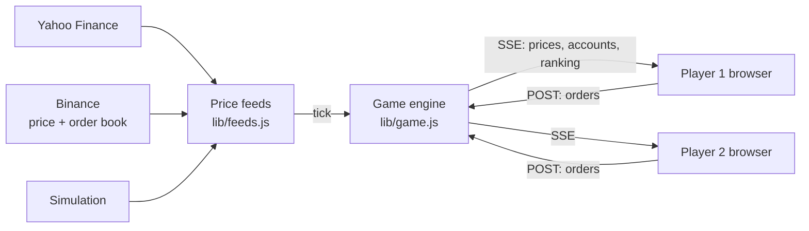

# DUEL — Real-Time Multiplayer Trading Simulator

**▶ [Play online](https://duel-trading.onrender.com)** · free hosting: the first load can take 30–60 seconds while the server wakes up.

An educational trading platform: every player gets a €10,000 demo account and trades crude oil, gold, EUR/USD or
bitcoin on **live market prices**, solo or head-to-head against friends. Players are ranked by performance.
The goal is to learn by doing what textbooks describe — leverage, margin, stop-losses, reward-to-risk, order books,
liquidity — under rules close to those of a real broker.


## Features

**Market data**
- Live prices from Yahoo Finance (WTI and Brent crude, gold, EUR/USD) and Binance (bitcoin). When a market is closed,
  the game switches automatically to a realistic simulation that alternates trending and ranging regimes.
- **Live bitcoin order book** (Binance): aggregated levels, walls, bid/ask imbalance, and depth drawn along the price axis.

**Realistic execution**
- Market, **limit and stop orders**, with stop-loss and take-profit levels you can drag directly on the chart.
- **Slippage** computed by walking the real order book for bitcoin, and from a depth model for other assets.
- **Dynamic spread** that widens as volatility rises.
- Leverage capped at EU retail limits (×30 EUR/USD, ×20 gold, ×10 oil, ×2 bitcoin).
- Margin, margin call at 100% and forced liquidation at a 50% margin level.
- Position management: stop to entry, partial close, trailing stop.
- Position sizing from the risk you choose (0.5% / 1% / 2% of equity).

**Analysis**
- 1- and 5-minute candlestick chart drawn on canvas: 20/50 moving averages, Bollinger Bands, RSI 14, volume.
- Automatic detection of support and resistance, ranges, trends, candle patterns and **liquidity zones**.
- Drawing tools: horizontal line, trend line, zone, Fibonacci retracement.
- A "Did you know" panel explaining one market concept in a few lines, refreshed every two minutes.

**Game**
- 5- to 60-minute games, up to 4 players, invitation by link or code.
- End-of-game report: ranking, win rate, best and worst trade, average reward/risk, maximum drawdown, and tips.
- Responsive interface: playable on a phone.

| Lobby | Results | Mobile |
|---|---|---|
|  |  |  |

## Architecture



- **Server as referee**: prices, order execution, stops, margin and rankings are all computed server-side, so every
  player sees exactly the same market and nobody can cheat from the browser.
- **Real time with Server-Sent Events**: a one-way stream is enough to broadcast prices, while orders go through plain
  POST requests. Prices are pushed up to once per second, and an order shows up on the opponent's screen in about 50 ms
  on a local network.
- **Zero dependencies**: native Node.js server (`http` module) and a framework-free HTML/CSS/JavaScript front end.
  Nothing to install, instant start-up.
- **Smooth rendering**: the chart is only redrawn when a price changes or the user interacts, and the technical analysis
  (levels, ranges, trends, patterns) is only recomputed on each new candle.
- **Resilience**: hard timeouts on every data source, automatic fallback to simulation, and a client clock synced to the
  server's, so devices with a skewed clock show the same countdown.

## Run locally

Requirements: [Node.js](https://nodejs.org) 18 or later.

```bash
git clone https://github.com/lacostetheo/duel-trading.git
cd duel-trading
npm start
# → http://localhost:3001
```

On a local network, the terminal also prints the address other players can open (e.g. `http://192.168.1.20:3001`).

## Project structure

```
server.js          HTTP server: pages, game streams (SSE), orders
lib/feeds.js       price sources, volume, order book, dynamic spread, simulation
lib/game.js        engine: accounts, orders, stops, pending orders, margin, slippage, ranking, report
lib/http.js        network requests with a hard timeout
public/            front end: chart (trade-chart.js), technical analysis (coach.js), order ticket and accounts (trade.js)
```

## About

A personal project by **Théo Lacoste**, built to learn how markets work by practising.
I designed the product, the market rules and the user experience, and developed the code with the AI coding assistant
**Claude Code** (Anthropic).

*Play money, for educational purposes only: nothing here is investment advice.*
